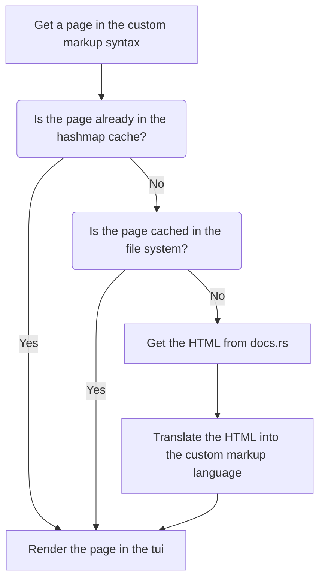

# Code Structure

```mermaid
flowchart TB
    get_page_in_markup[Get a page in the custom markup syntax] --> is_in_hashmap_cache(Is the page already in the hashmap cache?)
    is_in_hashmap_cache -->|Yes| render[Render the page in the tui]
    is_in_hashmap_cache -->|No| is_in_fs_cache(Is the page cached in the file system?)
    is_in_fs_cache -->|Yes| render
    is_in_fs_cache -->|No| get_from_docs_rs[Get the HTML from docs.rs] --> html_to_markup[Translate the HTML into the custom markup language] --> render
```
