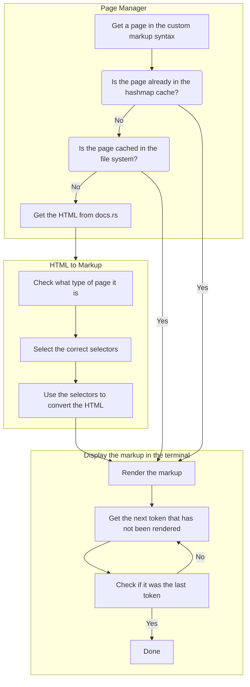

# Code Structure

```mermaid
flowchart TD
    subgraph page_manager_group [Page Manager]
        get_page_in_markup[Get a page in the custom markup syntax] --> is_in_hashmap_cache(Is the page already in the hashmap cache?)
        is_in_hashmap_cache -->|No| is_in_fs_cache(Is the page cached in the file system?)
        is_in_fs_cache -->|No| get_from_docs_rs[Get the HTML from docs.rs]
    end

    get_from_docs_rs --> html_to_markup_group

    is_in_fs_cache -->|Yes| render
    is_in_hashmap_cache -->|Yes| render

    subgraph html_to_markup_group [HTML to Markup]
        get_page_type[Check what type of page it is] --> select_selectors[Select the correct selectors] --> convert_html_to_markup[Use the selectors to convert the HTML]
    end

    convert_html_to_markup --> render

    subgraph display_group [Display the markup in the terminal]
        render[Render the markup] --> get_next_token[Get the next token that has not been rendered]
        get_next_token --> check_is_last[Check if it was the last token]
        check_is_last -->|No| get_next_token
        check_is_last -->|Yes| done[Done]
    end
```
